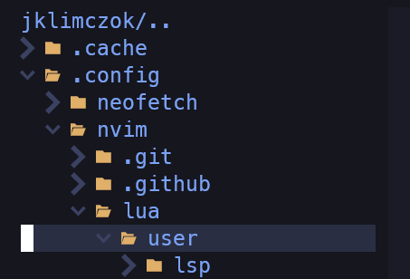
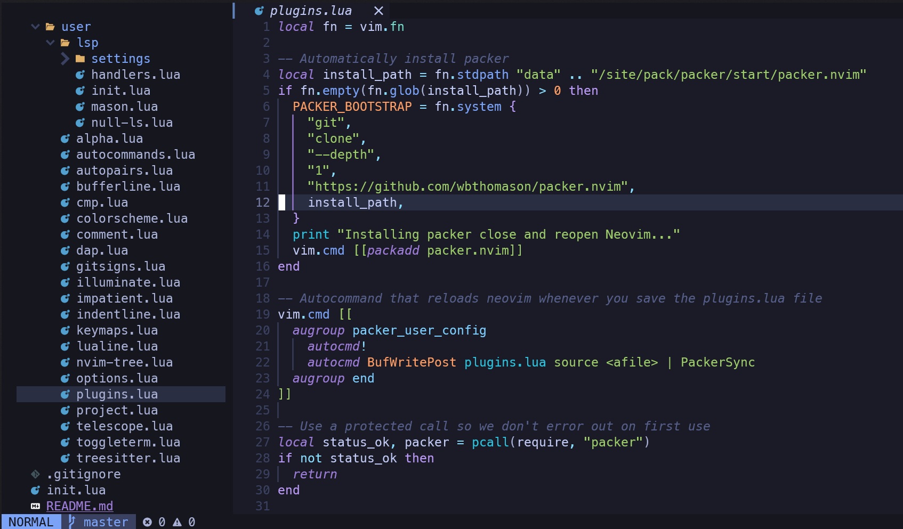
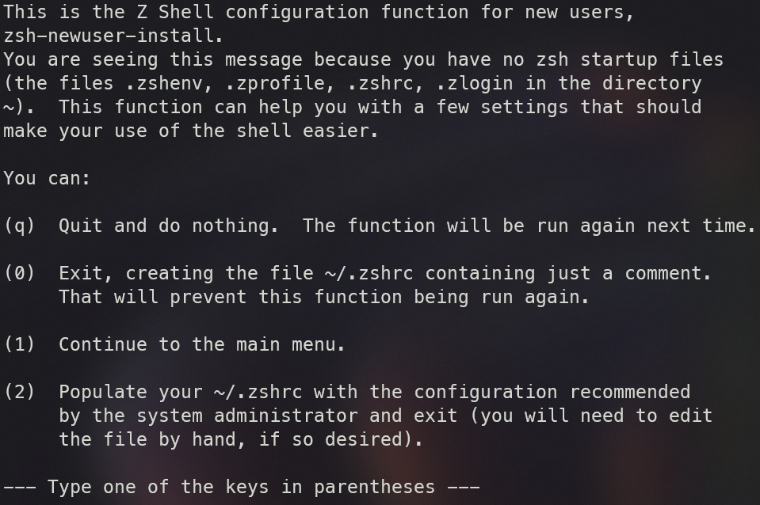

# WSL for Beginners
#WSL #Linux #Ubuntu #ArchLinux #Windows #Terminal #Workflow

## Installation WSL2 

### Voraussetzungen

- Windows Terminal Preview
- Windows 10 - version 2004 (build 19041) oder höher (Auf Quinscape PC's gegeben)

### Powershell

Bei Erstinstallation: `wsl --install` um Ubuntu zu installieren. 
Um eine andere Distribution auszuwählen erst `wsl --list --online` um mögliche Optionen aufzulisten und danach `wsl --install -d <Distribution Name>` um die gewünschte Distro zu installieren. 

Damit lassen sich später auch mehrere Distros gleichzeitig installieren. 


> Wenn WSL bereits installiert ist, funktioniert `wsl --install` nicht. In dem Fall muss man direkt eine Distribution mit `wsl --install -d` auswählen.
> 


Eine weitere Möglichkeit Distros zu installieren (Wenn sie z.B. nicht in der Liste aufgelistet werden), ist es sie als .exe Datei herunterzuladen. Beispiel "Arch Linux": [yuk7/ArchWSL auf Github](https://github.com/yuk7/ArchWSL/releases/latest)

>Um mehrere Installationen der gleichen Distro zu installieren, einfach die .exe Datei kopieren und umbenennen. 
>ArchLinux2.exe wird beispielsweise als ArchLinux2 installiert und kann neben Arch (von Arch.exe) laufen.

### Ubuntu

![[Screenshot_25.png]]

Sobald man Ubuntu zum ersten Mal gestartet und einen Nutzernamen und ein Passwort gesetzt hat, startet man automatisch im HOME Directory (~). Wenn man möchte kann man auch sofort loslegen, ich persönlich finde es aber etwas zu langweilig und mache mich immer erst daran mit ZSH eine andere Shell zu installieren, die mir die Möglichkeit gibt Plugins zu installieren, welche mir die Konsole etwas aufhübscht. Siehe dazu: [[#ZSH-Shell & powerlevel10k]]

#### Update & Upgrade des Packagemanagers

Bevor wir aber weiter machen, sollten wir zunächst Ubuntu und seine Systemwerkzeuge updaten.

Per `sudo apt update` und `sudo apt upgrade -y` sollte Ubuntu sich nach einigen Sekunden auf dem neuesten Stand befinden.

#### Ubuntu auf die neueste Version upgraden

Nachdem wir den Packagemanager geupdated haben, können wir auch Ubuntu auf die neueste Version upgraden. Zum aktuellen Zeitpunkt ist **20.04** die Standard Ubuntu Version, die WSL installiert, die aktuellste aber **22.04**.

Um Ubuntu zu upgraden sollten wir zuerst den Packagemanager upgraden (siehe vorheriger Schritt) und das Terminal neustarten.

Danach können wir Ubuntu per `sudo do-release-upgrade -d` updaten. Dies dauert eine Weile und verlangt wenige Userinputs. Am Ende muss man noch einmal das Terminal neustarten und Ubuntu sollte auf der neuesten Version sein. 

Überprüfen können wir das am **schönsten** mit "neofetch" 
(zu finden per `sudo apt install neofetch`):

![[Screenshot_39.png]]

#### Personal Package Archive (PPA)

Häufig findet man entweder nicht die gewünschten Programme im Standard Package Manager oder die Versionen sind stark veraltet (siehe [[#Neovim]]).
Um die Auswahl zu erweitern, können wir neben `apt` auch `apt-get` nutzen, um Community Packages per PPA zu installieren.

Um PPA nutzen zu können, müssen wir einfach folgende Dependency installieren (falls sie es nicht schon ist):

```
sudo apt install software-properties-common -y
```

Jetzt können wir per `sudo add-apt-repository ppa:<NAME/REPO> -y` und `sudo apt-get update` inoffizielle Packages in unseren Packagemanager importieren und dann per `sudo apt install <PACKAGE>` installieren.

## Verwendung

### Zugriff auf Linuxdateien in Windows

`//wsl$` im Windows Explorer oder `explorer.exe .` in der WSL Shell (. nicht vergessen!) 

![[Screenshot_22.png]]

### Zugriff auf Windowsdateien in Linux

Die Systemfestplatte C: wird in WSL direkt gemountet und ist per `cd /mnt/c` aufrufbar

![[Screenshot_30.png]]

### Remote Development in VSCode

Mit der Remote Development Extension für Microsoft VSCode kann man aus VSCode direkt auf eine Entwicklungsumgebung in Linux (WSL) zugreifen. Dafür startet man zunächst VSCode in Windows und installiert die [Extension](https://marketplace.visualstudio.com/items?itemName=ms-vscode-remote.vscode-remote-extensionpack).

![[Screenshot_31.png]]

Nun kann man in der WSL Shell in ein Verzeichnis navigieren, in dem ein Projekt liegt und dieses dann mit `code .` öffnen (auch hier den Punkt nicht vergessen). 

![[Screenshot_32.png]]

Hat man einen Ordner im Windows Dateisystem geöffnet, wird man von VSCode darauf hingewiesen die Dateien ins Linux Dateisystem zu kopieren, um auch die vollen Geschwindigkeitsvorteile einer Linux Entwicklungsumgebung genießen zu können.
Wenn alles funktioniert hat, sollte man unten Links in VSCode nun das Remote WSL Icon sehen:

![[Screenshot_33.png]]

>Wenn man p10k (siehe unten) installiert hat und das VSCode Terminal nutzen möchte, sollte man in den Einstellungen des Terminals die korrekte Schriftart setzen. Im Falle von Meslo sieht das folgendermaßen aus:
>![[Screenshot_34.png]]

## Development in Neovim

Dieser Punkt ist unterteilt in zwei Unterpunkte. Der erste befasst sich mit der Installation von Node, was einerseits die Voraussetzung für JavaScript- und Webentwicklung darstellt, aber gleichzeitig auch Voraussetzung für den zweiten Punkt ist: Java Entwicklung in Neovim. 
Um eine zuverlässige und moderne Umgebungsentwicklung für Java in Neovim aufzubauen, brauchen wir Werkzeuge, die wir nur mithilfe des Node Packacke Managers "npm" bekommen können.

### Node

#### nvm

Zunächst installieren wir den Node Version Manager nvm:

```
curl -o- https://raw.githubusercontent.com/nvm-sh/nvm/v0.37.2/install.sh | zsh
```

Danach starten wir die Shell neu mit `exec zsh` und schon können wir nvm nutzen.

Mit `command -v nvm` können wir überprüfen, ob alles funktioniert hat. Sollte dies der Fall sein, sollte dem Befehl die Ausgabe `nvm` folgen. 
Die aktuelle Version von nvm erfragen wir per `nvm --version`

![[Screenshot_36.png]]

#### Node & npm installieren

Mit nvm können wir nun per `nvm install node` Node installieren.

![[Screenshot_37.png]]

Mit Node sollte nun auch npm installiert sein. Überprüfen können wir das per `npm -v`

![[Screenshot_38.png]]

### Neovim

#### Neovim installieren

Jetzt ist ein guter Zeitpunkt Neovim zu installieren. Neovim ist ein moderner Fork von Vim, der es ermöglicht eine zeitgemäße Entwicklungsumgebung in Linux zu nutzen ohne auf die klassische Schlichtheit von Vim verzichten zu müssen. 

Wichtig ist erst einmal sicherzustellen, dass Ubuntu und der Packagemanager auf dem neusten Stand sind (siehe [[#Update & Upgrade]])

Jetzt könnten wir Neovim per `sudo apt install neovim` installieren, würden in den meisten Fällen aber eine veraltete Version bekommen. Um Funktionen wie z.B. Languageserver und Debugger nutzen zu können, müssen wir sicherstellen, die neueste Version von Neovim zu installieren.

Dies machen wir per [[#Personal Package Archive (PPA)]]:

Wir haben die Wahl zwischen der Stable oder Unstable Version von Neovim. Da zum aktuellen Zeitpunkt die unstable Version auf 0.9 liegt, die stable aber erst auf 0.7, entscheide ich mich für die Unstable und damit die Neueste.

Den aktuellen Versionsstand kann man hier nachschauen:

>Stable: https://launchpad.net/~neovim-ppa/+archive/ubuntu/stable
>Unstable: https://launchpad.net/~neovim-ppa/+archive/ubuntu/unstable

Mit folgenden Befehlen installieren wir die aktuellste Version von Neovim

```
sudo add-apt-repository ppa:neovim-ppa/unstable -y
sudo apt-get update
sudo apt install neovim -y
``` 

Wenn alles erfolgreich war, sollte `nvim --version` ungefähr so aussehen:

![[Screenshot_40.png]]

Mit `nvim` oder `nvim <Dateiname>` können wir jetzt Neovim starten.

> Neovim beenden: Esc, um sicherzustellen, dass man im normalen Modus ist und dann `:q` oder `:q!` 
> Speichern und beenden: `:wq`
> Neovim Tutorial: `:Tutor`

#### Konfigurationsdatei

Hier kommen wir in den Teil dieser Anleitung, der am meisten Potenzial hat, schiefzugehen, vor Allem, je älter sie wird. Sollte also irgendetwas nicht funktionieren, sollte man sicherstellen die Quellen nach Updates zu überprüfen. Die Kombination aus Neovim und WSL ist leider ein Kartenhaus, das einzustürzen droht, sobald ein Einzelteil geupdatet wird. Also nicht sofort aufgeben, der Fehler ist meistens leicht zu lösen.

Grundlage der Neovim Konfiguration ist die Arbeit des Entwicklers **Christian Chiarulli** und seiner Github Repo [nvim basic ide](https://github.com/LunarVim/nvim-basic-ide) und Youtube Videos [Neovim - Setting up a Java IDE](https://www.youtube.com/watch?v=0q_MKUynUck). Er hat neben diesen beiden noch viele weitere Ressourcen, die sich mit diesem Thema beschäftigen, sollte also etwas nicht funktionieren, findet man hier den besten Startpunkt für den Troubleshoot.

> Zum aktuellen Zeitpunkt ist sein Video 4 Monate alt und bereits nicht mehr aktuell, da "LspInstallInfo" nicht mehr existiert und das installieren des Lsp durch einen weiteren Dienst namens "Mason" bereitgestellt wird. Dies wird hier aber berücksichtigt.

Bevor wir seine Konfigurationsdatei installieren, sollten wir zunächst überprüfen, dass der Ordner "~/.config/nvim" nicht existiert. Sollte dieser existieren, kann man ihn einfach umbenennen oder löschen(`sudo rm -r ~/.config/nvim`).

```
git clone https://github.com/LunarVim/nvim-basic-ide.git ~/.config/nvim
```

Mit diesem Befehl sollten wir nun einen Ordner haben, in dem wir Neovim konfigurieren können. 
Wenn wir jetzt neovim per `nvim` starten, lädt das Programm die ersten Plugins. Hierbei wird es zu einigen Fehlern kommen. Das ist normal. Nach dem ersten Start beenden wir Neovim und starten es neu. Auch hier wird es zu Fehlern kommen. Auch das ist normal.

Nach mindestens 2 Neustarts sollte Neovim beim Aufrufen von `nvim` jetzt so aussehen:

![[Screenshot_41.png]]

Statt `f` zu drücken, kann man jetzt `Leertaste, e` eingeben und es öffnet sich links eine Art Fileexplorer mit dem man seine Dateien durchsuchen kann.

![[Screenshot_42.png]]

Als erstes sollten wir im Ordner `~/.config/nvim/lua/user` die Datei "plugins.lua" öffnen.

![[Screenshot_43.png]]

Hier sollten wir nach unten navigieren, bis wir den Punkt "--Automatically set up your configuration ..." erreichen. In den Zeilen davor setzen wir folgendes ein:

```
--Java
use 'mfussenegger/nvim-jdtls'
```

Damit sollte es nun folgendermaßen aussehen:

![[Screenshot_44.png]]

Nach Speichern per `:w` sollte sich nvim jetzt automatisch updaten und das neue Plugin installieren.


## ZSH-Shell & powerlevel10k

### ZSH Shell: 

`sudo apt install zsh` um die zsh Shell zu installieren und danach `zsh` um zsh zu starten. Beim ersten Start wird die Konfiguration aufgerufen:

![[Screenshot_26.png]]

Sobald diese abgeschlossen ist, sollte man "oh-my-zsh" installieren, damit es in Zukunft leichter ist Plugins zu aktivieren:

```
sh -c "$(curl -fsSL https://raw.githubusercontent.com/robbyrussell/oh-my-zsh/master/tools/install.sh)"
```

Dadurch bekommt man auch die Option ZSH als Standard Shell zu aktivieren.

![[Screenshot_27.png]]

Spätenstens für den nächsten Schritt benötigt man eine Schriftart, die Icons unterstützt. Empfohlen wird "Meslo NF", auf [nerdfonds.com](https://www.nerdfonts.com) werden aber viele weitere angeboten. Hier kann [MesloNF](https://github.com/romkatv/dotfiles-public/raw/master/.local/share/fonts/NerdFonts/MesloLGS%20NF%20Regular.ttf) direkt heruntergeladen werden.

Als letzten Schritt muss jetzt nur noch powerlevel10k installiert werden. Dafür aus dem Homedirectory (~ oder cd ~) folgendes aufrufen:

```
git clone --depth=1 https://github.com/romkatv/powerlevel10k.git $ZSH_CUSTOM/themes/powerlevel10k
```

Als nächstes muss man p10k noch in der Konfigurationsdatei von zsh als Theme setzen. Dafür ruft man per `nano .zshrc` oder `vim .zshrc` die Datei auf und sucht nach folgender Zeile

```
ZSH_THEME="robburussell"
```

Diese ersetzt man mit folgendem:

```
ZSH_THEME="powerlevel10k/powerlevel10k"
```

Um die Shell neuzustarten, gibt man nun `exec zsh` ein und es sollte die Erstkonfiguration von powerlevel10k starten. Man kann diese aber auch manuell per `p10k configure` aufrufen.

![[Screenshot_28.png]]

Wenn alles korrekt eingestellt ist, sollte es etwa so ausschauen:

![[Screenshot_29.png]]


## Weiterführende Links

- [Übersicht Plugins für oh-my-zsh](https://github.com/ohmyzsh/ohmyzsh/wiki/Plugins)
- [Neovim Cheat Sheet](https://github.com/mattmc3/neovim-cheatsheet)
- 


## Quellen/Referenzen

- [WSL Setup Microsoft](https://learn.microsoft.com/en-us/windows/wsl/install)
- [Installation von NVM und Node](https://www.linode.com/docs/guides/how-to-install-use-node-version-manager-nvm/#installing-and-configuring-nvm)
- [Installation von npm in Linux](https://www.linode.com/docs/guides/install-and-use-npm-on-linux/)
- [Upgrade Ubuntu](https://www.linuxtechi.com/upgrade-ubuntu-20-04-to-ubuntu-22-04/)
- [Neovim installieren](https://www.linuxcapable.com/how-to-install-neovim-editor-on-ubuntu-22-04-lts/)
- [Packages in Ubuntu deinstallieren](https://phoenixnap.com/kb/uninstall-packages-programs-ubuntu)
- [LSP Java Unterstützung für NVIM](https://github.com/mfussenegger/nvim-jdtls)
- 