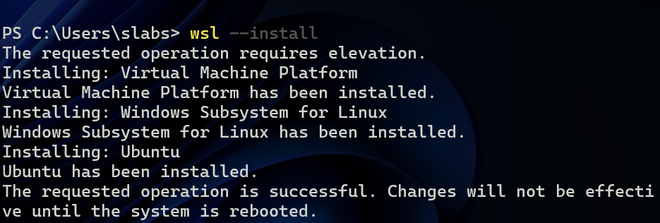
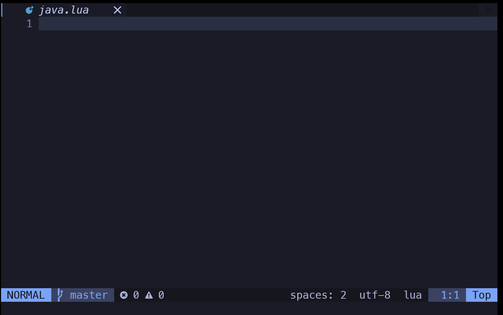
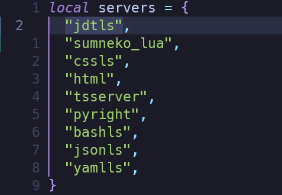
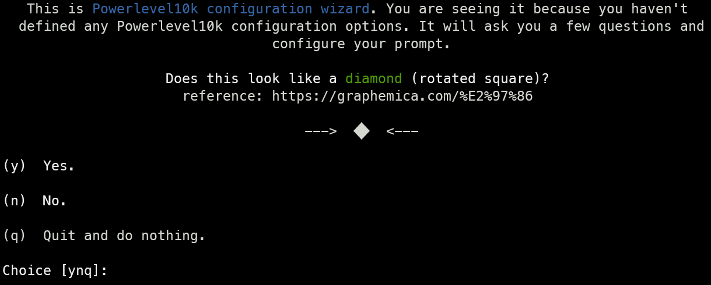

#WSL #Linux #Ubuntu #ArchLinux #Windows #Terminal #Workflow

---
## Inhalt

[Installation WSL2](#Installation%20WSL2)
- [Voraussetzungen](#Voraussetzungen)
- [Powershell](#Powershell)
- [Ubuntu](#Ubuntu)
	- [Update & Upgrade des Packagemanagers](#Update%20&%20Upgrade%20des%20Packagemanagers)
	- [Ubuntu auf die neueste Version upgraden](#Ubuntu%20auf%20die%20neueste%20Version%20upgraden)
	- [Personal Package Archive (PPA)](#Personal%20Package%20Archive%20(PPA))
[Verwendung](#Verwendung)
- [Zugriff auf Linuxdateien in Windows](#Zugriff%20auf%20Linuxdateien%20in%20Windows)
- [Zugriff auf Windowsdateien in Linux](#Zugriff%20auf%20Windowsdateien%20in%20Linux)
- [Remote Development in VSCode](#Remote%20Development%20in%20VSCode)
- [Remote Development in IntelliJ Idea](#Remote%20Development%20in%20IntelliJ%20Idea)
- [Apache Server](#Apache%20Server)
- [Programme mit graphischer Oberfläche (x11)](#Programme%20mit%20graphischer%20Oberfläche%20(x11))
- [Development in Neovim](#Development%20in%20Neovim)
	- [Voraussetzungen für Neovim](#Voraussetzungen%20für%20Neovim)
		- [unzip](#unzip)
		- [C-Compiler](#C-Compiler)
		- [Java](#Java)
	- [Node](#Node)
		- [nvm](#nvm)
		- [Node & npm installieren](#Node%20&%20npm%20installieren)
	- [Neovim](#Neovim)
		- [Neovim installieren](#Neovim%20installieren)
		- [Konfiguration & Erweiterungen](#Konfiguration%20&%20Erweiterungen)
			- [Chris' Konfigurationsdatei:](#Chris'%20Konfigurationsdatei:)
			- [Debugger:](#Debugger:)
			- [ftplugin/java.lua:](#ftplugin/java.lua:)
			- [mason.lua:](#mason.lua:)
[ZSH-Shell & powerlevel10k](#ZSH-Shell%20&%20powerlevel10k)
- [ZSH Shell:](#ZSH%20Shell:)
- [Oh-My-ZSH](#Oh-My-ZSH)
- [NerdFonts Meslo](#NerdFonts%20Meslo)
- [Powerlevel10k](#Powerlevel10k)

---

## Installation WSL2 

### Voraussetzungen

- Windows Terminal (Kostenlos im Windows Store als Windows Terminal Preview verfügbar)
- Windows 10 - version 2004 (build 19041) oder höher (Auf Quinscape PC's gegeben)
- Grundlegende Kentnisse mit Git und GitHub

### Powershell

Bei Erstinstallation: `wsl --install` um Ubuntu zu installieren. 
Um eine andere Distribution auszuwählen erst `wsl --list --online` um mögliche Optionen aufzulisten und danach `wsl --install -d <Distribution Name>` um die gewünschte Distro zu installieren. 

Damit lassen sich später auch mehrere Distros gleichzeitig installieren. 



> Wenn WSL bereits installiert ist, funktioniert `wsl --install` nicht. In dem Fall muss man direkt eine Distribution mit `wsl --install -d` auswählen.
> 


Eine weitere Möglichkeit Distros zu installieren (Wenn sie z.B. nicht in der Liste aufgelistet werden), ist es sie als .exe Datei herunterzuladen. Beispiel "Arch Linux": [yuk7/ArchWSL auf Github](https://github.com/yuk7/ArchWSL/releases/latest)

>Um mehrere Installationen der gleichen Distro zu installieren, einfach die .exe Datei kopieren und umbenennen. 
>ArchLinux2.exe wird beispielsweise als ArchLinux2 installiert und kann neben Arch (von Arch.exe) laufen.

### Ubuntu


Sobald man Ubuntu zum ersten Mal gestartet und einen Nutzernamen und ein Passwort gesetzt hat, startet man automatisch im HOME Directory (~). Wenn man möchte kann man auch sofort loslegen, ich persönlich finde es aber etwas zu langweilig und mache mich immer erst daran mit ZSH eine andere Shell zu installieren, die mir die Möglichkeit gibt Plugins zu installieren, welche mir die Konsole etwas aufhübscht. Siehe dazu: [ZSH-Shell & powerlevel10k](#ZSH-Shell%20&%20powerlevel10k)

#### Update & Upgrade des Packagemanagers

Bevor wir aber weiter machen, sollten wir zunächst Ubuntu und seine Systemwerkzeuge updaten.

Per `sudo apt update` und `sudo apt upgrade -y` sollte Ubuntu sich nach einigen Sekunden auf dem neuesten Stand befinden.

#### Ubuntu auf die neueste Version upgraden

Nachdem wir den Packagemanager geupdated haben, können wir auch Ubuntu auf die neueste Version upgraden. Zum aktuellen Zeitpunkt ist **20.04** die Standard Ubuntu Version, die WSL installiert, die aktuellste aber **22.04**.

Um Ubuntu zu upgraden sollten wir zuerst den Packagemanager upgraden (siehe vorheriger Schritt) und das Terminal neustarten.

Danach können wir Ubuntu per `sudo do-release-upgrade -d` updaten. Dies dauert eine Weile und verlangt wenige Userinputs. Am Ende muss man noch einmal das Terminal neustarten und Ubuntu sollte auf der neuesten Version sein. 

Überprüfen können wir das am **schönsten** mit "neofetch" 
(zu finden per `sudo apt install neofetch`):


#### Personal Package Archive (PPA)

Häufig findet man entweder nicht die gewünschten Programme im Standard Package Manager oder die Versionen sind stark veraltet (siehe [Neovim](#Neovim)).
Um die Auswahl zu erweitern, können wir neben `apt` auch `apt-get` nutzen, um Community Packages per PPA zu installieren.

Um PPA nutzen zu können, müssen wir einfach folgende Dependency installieren (falls sie es nicht schon ist):

```
sudo apt install software-properties-common -y
```

Jetzt können wir per `sudo add-apt-repository ppa:<NAME/REPO> -y` und `sudo apt-get update` inoffizielle Packages in unseren Packagemanager importieren und dann per `sudo apt install <PACKAGE>` installieren.

---

## Verwendung

### Zugriff auf Linuxdateien in Windows

`\\wsl$` im Windows Explorer oder `explorer.exe .` in der WSL Shell (. nicht vergessen!) 


### Zugriff auf Windowsdateien in Linux

Die Systemfestplatte C: wird in WSL direkt gemountet und ist per `cd /mnt/c` aufrufbar


### Remote Development in VSCode

Mit der Remote Development Extension für Microsoft VSCode kann man aus VSCode direkt auf eine Entwicklungsumgebung in Linux (WSL) zugreifen. Dafür startet man zunächst VSCode **in Windows** und installiert die [Extension](https://marketplace.visualstudio.com/items?itemName=ms-vscode-remote.vscode-remote-extensionpack).


Nun kann man in der WSL Shell in ein Verzeichnis navigieren, in dem ein Projekt liegt und dieses dann mit `code .` öffnen (auch hier den Punkt nicht vergessen). 


Hat man einen Ordner im Windows Dateisystem geöffnet, wird man von VSCode darauf hingewiesen die Dateien ins Linux Dateisystem zu kopieren, um auch die vollen Geschwindigkeitsvorteile einer Linux Entwicklungsumgebung genießen zu können.
Wenn alles funktioniert hat, sollte man unten Links in VSCode nun das Remote WSL Icon sehen:


>Wenn man p10k (siehe unten) installiert hat und das VSCode Terminal nutzen möchte, sollte man in den Einstellungen des Terminals die korrekte Schriftart setzen. Im Falle von Meslo sieht das folgendermaßen aus:
>

### Remote Development in IntelliJ Idea

Was in VSCode funktioniert, das geht selbstverständlich auch in IntelliJ und das sogar noch einfacher. So lange WSL2 im Hintergrund aktiv ist, kann man beim erstellen eines neuen Projektes den Speicherort `\\wsl$\..` und die JDK, die man vorher auf dem WSL System installiert hat auswählen. Es wird kein Plugin benötigt.

>Sollte noch keine JDK auf dem WSL System vorhanden sein, wird das hier erklärt: [Java](#Java)


Wie man auf den Screenshots erkennen kann, werden auch Maven und Gradle Projekte unterstützt.

### Apache Server 

Einer der Vorteile an Linux ist es, dass es wesentlich simpler ist einen Apache Webserver aufzusetzen und zum Laufen zu bringen. Das selbe gilt auch für Linux unter WSL.

Alles was wir dafür tun müssen, ist mit `sudo apt install apache2` die Apache2 Software zu installieren und sie mit `sudo service apache2 start` zu starten. Schon läuft im Hintergrund der Server und ist für alle Schandtaten bereit.

>Wenn wir auf den Server im Browser zugreifen möchten, müssen wir unsere IP Adresse herausfinden. Das geht am simpelsten per `ip address`. Die Adresse, die wir suchen, finden wir unter "eth0: inet"
>


Ein paar weitere nützliche Apache2 Befehle:

| Funktion | Befehl |
|-----------|------------------------------|
| Beenden | `sudo service apache2 stop` |
| Neustarten | `sudo service apache2 restart` |
| Status | `sudo service apache2 status` |


### Programme mit graphischer Oberfläche (x11)

Auf Windows 11 lassen sich mit WSL graphische Programme starten und wie Desktop Apps starten. Um das auch auf Windows 10 zu können, muss man leider zusätzlich einen X11 Server installieren. 

Den Server auf Win10 zu installieren übertrifft leider den scope dieses Dokuments und auch meiner technischen Expertise, sollte aber jemand in einer fernen Zukunft hierher zurückfinden, in der Quinscape Windows 11 unterstützt, kann man das folgendermaßen testen:

```
sudo apt install x11-apps -y
```

Damit installieren wir rudimentäre Programme mit graphischer Oberfläche. Zwei davon sind xcalc und xclock, die man jeweils mit `xcalc`, respektive `xclock` starten kann. 
Wenn das funktioniert, dann sollte man auch Programme wie GIMP oder Audacity etc. installieren können.


### Development in Neovim

Dieser Punkt ist sehr umfassend, sehr optional und unterteilt in zwei Unterpunkte. Der erste befasst sich mit der Installation von Node, was einerseits die Voraussetzung für JavaScript- und Webentwicklung darstellt, aber gleichzeitig auch Voraussetzung für den zweiten Punkt ist: Java Entwicklung in Neovim. 
Um eine zuverlässige und moderne Umgebungsentwicklung für Java in Neovim aufzubauen, brauchen wir Werkzeuge, die wir nur mithilfe des Node Packacke Managers "npm" bekommen können. 

>Nocheinmal: Dieser Punkt ist optional und zeigt was nur in einer Konsole dank einer sehr eifrigen Community möglich ist. Der einzige Vorteil gegenüber klassischen IDE's ist maximal, dass man sich seine eigene IDE zusammenbauen und auf jegliche Ablenkungen verzichten kann, die man nicht benötigt.
>Viele Programmierer bevorzugen das Entwickeln in Neovim, aber es ist bei weitem nicht jedermanns Sache.


### Voraussetzungen für Neovim

Damit die folgenden Punkte funktionieren können, müssen wir auf Ubuntu `unzip` und einen C-Compiler installieren.

#### unzip

`unzip` erhalten wir mit `sudo apt install unzip`

#### C-Compiler

Der einfachste Weg einen C Compiler zu installieren, ist es das build essentials Package zu installieren. Dies geht mit folgendem Befehl:

```
sudo apt-get update && sudo apt-get install build-essential
```

#### Java

Bevor wir Neovim für die Java Entwicklung nutzen können, benötigen wir natürlich eine aktuelle Version von Java. Diese können wir per `sudo apt search JSK` suchen. Ich habe mich hier für die openjdk-18-jdk entschieden.

Mit `sudo apt install openjdk-18-jdk` kann man die JDK Version 18 installieren und sofort nutzen.


### Node

#### nvm

Zunächst installieren wir den Node Version Manager nvm:

```
curl -o- https://raw.githubusercontent.com/nvm-sh/nvm/v0.37.2/install.sh | zsh
```

Danach starten wir die Shell neu mit `exec zsh` und schon können wir nvm nutzen.

Mit `command -v nvm` können wir überprüfen, ob alles funktioniert hat. Sollte dies der Fall sein, sollte dem Befehl die Ausgabe `nvm` folgen. 
Die aktuelle Version von nvm erfragen wir per `nvm --version`


#### Node & npm installieren

Mit nvm können wir nun per `nvm install node` Node installieren.


Mit Node sollte nun auch npm installiert sein. Überprüfen können wir das per `npm -v`


### Neovim (Work in Progress!)

>Dieser Bereich wird noch überarbeitet und Dinge hinzugefügt, da wir hier eine eigene auf Vim aufgebaute IDE bauen.

#### Neovim installieren

Jetzt ist ein guter Zeitpunkt Neovim zu installieren. Neovim ist ein moderner Fork von Vim, der es ermöglicht eine zeitgemäße Entwicklungsumgebung in Linux zu nutzen ohne auf die klassische Schlichtheit von Vim verzichten zu müssen. 

Wichtig ist erst einmal sicherzustellen, dass Ubuntu und der Packagemanager auf dem neusten Stand sind (siehe [Update & Upgrade des Packagemanagers](#Update%20&%20Upgrade%20des%20Packagemanagers))

Jetzt könnten wir Neovim per `sudo apt install neovim` installieren, würden in den meisten Fällen aber eine veraltete Version bekommen. Um Funktionen wie z.B. Languageserver und Debugger nutzen zu können, müssen wir sicherstellen, die neueste Version von Neovim zu installieren.

Dies machen wir per [Personal Package Archive (PPA)](#Personal%20Package%20Archive%20(PPA)):

Wir haben die Wahl zwischen der Stable oder Unstable Version von Neovim. Da zum aktuellen Zeitpunkt die unstable Version auf 0.9 liegt, die stable aber erst auf 0.7, entscheide ich mich für die Unstable und damit die Neueste.

Den aktuellen Versionsstand kann man hier nachschauen:

>Stable: https://launchpad.net/~neovim-ppa/+archive/ubuntu/stable
>Unstable: https://launchpad.net/~neovim-ppa/+archive/ubuntu/unstable

Mit folgenden Befehlen installieren wir die aktuellste Version von Neovim

```
sudo add-apt-repository ppa:neovim-ppa/unstable -y
sudo apt-get update
sudo apt install neovim -y
``` 

Wenn alles erfolgreich war, sollte `nvim --version` ungefähr so aussehen:


Mit `nvim` oder `nvim <Dateiname>` können wir jetzt Neovim starten.

> Neovim beenden: Esc, um sicherzustellen, dass man im normalen Modus ist und dann `:q` oder `:q!` 
> Speichern und beenden: `:wq`
> Neovim Tutorial: `:Tutor`

#### Konfiguration & Erweiterungen

Hier kommen wir in den Teil dieser Anleitung, der am meisten Potenzial hat, schiefzugehen, vor Allem, je älter sie wird. Sollte also irgendetwas nicht funktionieren, sollte man sicherstellen die Quellen nach Updates zu überprüfen. Die Kombination aus Neovim und WSL ist leider ein Kartenhaus, das einzustürzen droht, sobald ein Einzelteil geupdatet wird. Also nicht sofort aufgeben, der Fehler ist meistens leicht zu lösen.

Grundlage der Neovim Konfiguration ist die Arbeit des Entwicklers **Christian Chiarulli** und seiner Github Repos [nvim basic ide](https://github.com/LunarVim/nvim-basic-ide) und Youtube Videos [Neovim - Setting up a Java IDE](https://www.youtube.com/watch?v=0q_MKUynUck). Er hat neben diesen beiden noch viele weitere Ressourcen, die sich mit diesem Thema beschäftigen, sollte also etwas nicht funktionieren, findet man hier den besten Startpunkt für den Troubleshoot.

> Zum aktuellen Zeitpunkt ist sein Video 4 Monate alt und bereits nicht mehr aktuell, da "LspInstallInfo" nicht mehr existiert und das installieren des Lsp durch einen weiteren Dienst namens "Mason" bereitgestellt wird. Dies wird hier aber berücksichtigt.

##### Chris' Konfigurationsdatei:

Bevor wir seine Konfigurationsdatei installieren, sollten wir zunächst überprüfen, dass der Ordner "~/.config/nvim" nicht existiert. Sollte dieser existieren, kann man ihn einfach umbenennen oder löschen(`sudo rm -r ~/.config/nvim`).

```
git clone https://github.com/LunarVim/nvim-basic-ide.git ~/.config/nvim
```

Mit diesem Befehl sollten wir nun einen Ordner haben, in dem wir Neovim konfigurieren können. 
Wenn wir jetzt neovim per `nvim` starten, lädt das Programm die ersten Plugins. Hierbei wird es zu einigen Fehlern kommen. Das ist normal. Nach dem ersten Start beenden wir Neovim und starten es neu. Auch hier wird es zu Fehlern kommen. Auch das ist normal.

Nach mindestens 2 Neustarts sollte Neovim beim Aufrufen von `nvim` jetzt so aussehen:


Statt `f` zu drücken, kann man jetzt `Leertaste, e` eingeben und es öffnet sich links eine Art Fileexplorer mit dem man seine Dateien durchsuchen kann.


Als erstes sollten wir im Ordner `~/.config/nvim/lua/user` die Datei "plugins.lua" öffnen.


Hier sollten wir nach unten navigieren, bis wir den Punkt "--Automatically set up your configuration ..." erreichen. In den Zeilen davor setzen wir folgendes ein:

```
--Java
use 'mfussenegger/nvim-jdtls'
```

Damit sollte es nun folgendermaßen aussehen:


##### Debugger:

Nach Speichern per `:w` sollte sich nvim jetzt automatisch updaten und das neue Plugin installieren. Damit dieses auch funktionieren kann, müssen wir als nächstes die Java Debug und VSCode Java Test Extensions von Microsoft installieren. Dafür clonen wir folgende Repos (Sicherstellen, dass wir uns im Ordner `~/.config/nvim` befinden):

- https://github.com/microsoft/java-debug
- https://github.com/microsoft/vscode-java-test


> Einer der Vorteile von zsh und oh-my-zsh ist, dass es viele vorkonfigurierten Alias' für Git hat. Hier sieht man z.B. `gcl` was der Alias für `git clone --recurse-submodules` ist.

Per `cd java-debug` wechseln wir nun in das neue Verzeichnis und installieren mit `./mvnw clean install` den Java Debugger. Sollte Linux eine Fehlermeldung ausgeben, ist es wahrscheinlich, dass Java noch nicht installiert ist (siehe [Java](#Java)), da das Installieren über einen Maven Wrapper durchgeführt wird.

Wenn alles geklappt hat, dauert es ein paar Momente und dann sollte der Java Debugger zur Verfügung stehen.


Als nächstes wechseln wir in den vscode-java-test Ordner und installieren diese Extension mit [Node](#Node) folgendermaßen:

```
npm install
npm run build-plugin
```

Auch das wird einige Momente in Anspruch nehmen und sollte die nötigen Dateien aus dem Internet herunterladen. Sollte es hier haken, liegt es evtl. daran, dass Node nicht installiert ist (siehe [Node](#Node)).


##### ftplugin/java.lua:

Für den nächsten Schritt müssen wir den Ordner `~/.config/nvim/ftplugin/` anlegen.


Als nächstes starten wir Neovim und erstellen eine Datei mit dem Befehl `nvim java.lua` (Im ftplugin Ordner)



Zu allererst sollten wir die Datei mit `:w` speichern, damit diese auch existiert. Danach müssen wir den gesamten Inhalt aus folgender Datei kopieren und in unsere `java.lua` Datei einfügen (Wenn bis hierher alles funktioniert hat, sollte das Einfügen in Neovim mit der p Taste klappen):

>https://github.com/ChristianChiarulli/nvim/blob/master/ftplugin/java.lua

Als nächstes scrollen wir bis nach fast ganz unten, markieren die Zeilen von `local status_ok, which_key = pcall(require, "which-key")` bis `which_key.register(vmappings, vopts)` und kommentieren diese aus.

>Markieren in nvim: v
>Auskommentieren mehrerer Zeilen: Leer-/


> Anhand der grünen Linien am linken Bildrand erkennen wir, dass Neovim uns bereits Änderungen der Datei anzeigt, die noch nicht per git committed wurden.

Als nächstes installieren wir den Java Language Server mit Mason. Dafür bleiben wir in Neovim und rufen Mason mit `:Mason` auf. Hier sehen wir eine Auswahl von vielen verschiedenen Languageservern für alle Sprachen, die unterstützt werden. Einige, wie html und css sind bereits vorinstalliert, viele andere müssen wir manuell nachinstallieren. So auch den für Java. 

Wir scrollen nach unten, bis sich der Cursor über der Zeile `jdtls` befindet und drücken die Taste `i` zum installieren. Nach ein paar Sekunden, sollte die Neovim Statusleiste "mason.nvim "jdtls' was successfully installed" sagen und jdtls sollte sich unter den installierten Servern wiederfinden.


Mit der Taste `q` können wir das Mason Fenster wieder schließen.

Nun müssen wir noch ein paar Zeilen in der Konfigurationsdatei anpassen, da diese leider veraltet ist und nicht mehr zu den korrekten jdtls Installationsordnern zeigt.

Ungefähr in der Mitte der Datei finden wir 4 Bereiche, die mit Totenkopf-Icons markiert sind. Die zwei Punkte, die wir hier anpassen müssen sind mit dem zweiten und dritten Totenkopf markiert: "-jar" und "-configuration".

Unter "-jar" ersetzen wir die Zeile mit Folgendem:

```
vim.fn.glob(home .. "/.local/share/nvim/mason/packages/jdtls/plugins/org.eclipse.equinox.launcher_*.jar"),
```

Und unter "-configuration" ersetzen wir die Zeile mit Folgendem:

```
home .. "/.local/share/nvim/mason/packages/jdtls/config_" .. CONFIG,
```

Ein paar Zeilen weiter oben finden wir eine weitere Zeile in der wir "`/lsp_servers/`"  zu "`/mason/packages/`" ändern, oder wie zuvor die ganze Zeile gegen Folgende austauschen müssen:

```
"-javaagent:" .. home .. "/.local/share/nvim/mason/packages/jdtls/lombok.jar",
```


Mit `:wq` speichern und schließen wir Neovim nun.

##### mason.lua:

Als nächstes öffnen wir die Datei `~/.config/nvim/lua/user/lsp/mason.lua` und fügen folgendes in Zeile 2 ein:

```
"jdtls",
```

Die ersten Zeilen der Datei sollten nun so aussehen:



Wenn wir nun die Datei speichern und schließen und daraufhin eine .java Datei öffnen, sollte nach ein paar Sekunden der Java LSP starten.


---

## ZSH-Shell & powerlevel10k

### ZSH Shell

`sudo apt install zsh` um die zsh Shell zu installieren und danach `zsh` um zsh zu starten. Beim ersten Start wird die Konfiguration aufgerufen:


### Oh-My-ZSH

Sobald diese abgeschlossen ist, sollte man "oh-my-zsh" installieren, damit es in Zukunft leichter ist Plugins zu aktivieren:

```
sh -c "$(curl -fsSL https://raw.githubusercontent.com/robbyrussell/oh-my-zsh/master/tools/install.sh)"
```

Dadurch bekommt man auch die Option ZSH als Standard Shell zu aktivieren.


### NerdFonts Meslo

Spätenstens für den nächsten Schritt benötigt man eine Schriftart, die Icons unterstützt. Empfohlen wird "Meslo NF", auf [nerdfonds.com](https://www.nerdfonts.com) werden aber viele weitere angeboten. Hier kann [MesloNF](https://github.com/romkatv/dotfiles-public/raw/master/.local/share/fonts/NerdFonts/MesloLGS%20NF%20Regular.ttf) direkt heruntergeladen werden.

### Powerlevel10k

Als letzten Schritt muss jetzt nur noch powerlevel10k installiert werden. Dafür aus dem Homedirectory (~ oder cd ~) folgendes aufrufen:

```
git clone --depth=1 https://github.com/romkatv/powerlevel10k.git $ZSH_CUSTOM/themes/powerlevel10k
```

Als nächstes muss man p10k noch in der Konfigurationsdatei von zsh als Theme setzen. Dafür ruft man per `nano .zshrc` oder `vim .zshrc` die Datei auf und sucht nach folgender Zeile

```
ZSH_THEME="robburussell"
```

Diese ersetzt man mit folgendem:

```
ZSH_THEME="powerlevel10k/powerlevel10k"
```

Um die Shell neuzustarten, gibt man nun `exec zsh` ein und es sollte die Erstkonfiguration von powerlevel10k starten. Man kann diese aber auch manuell per `p10k configure` aufrufen.



Wenn alles korrekt eingestellt ist, sollte die Shell jetzt etwa so ausschauen:


---

## Weiterführende Links

- [Übersicht Plugins für oh-my-zsh](https://github.com/ohmyzsh/ohmyzsh/wiki/Plugins)
- [Neovim Cheat Sheet](https://github.com/mattmc3/neovim-cheatsheet)
- [Youtube: Dave's Garage - Windows and Linux: Together at Last](https://www.youtube.com/watch?v=clZCrVZH4Gg)
- [Youtube: The Digital Life - Install Kali Linux - WSL2 KEX GUI hacking setup](https://www.youtube.com/watch?v=_cXmx2qwWts)
- [Youtube: Devaslife - Set up Neovim on a new M2 MacBook Air for coding React, TypeScript, Tailwind CSS, etc.](https://www.youtube.com/watch?v=ajmK0ZNcM4Q)
- [Youtube: Nick Janetakis - A Linux Dev Environment on Windows with WSL 2, Docker Desktop and More](https://www.youtube.com/watch?v=idW-an99TAM)
- 

---

## Quellen/Referenzen

- [WSL Setup Microsoft](https://learn.microsoft.com/en-us/windows/wsl/install)
- [Installation von NVM und Node](https://www.linode.com/docs/guides/how-to-install-use-node-version-manager-nvm/#installing-and-configuring-nvm)
- [Installation von npm in Linux](https://www.linode.com/docs/guides/install-and-use-npm-on-linux/)
- [Upgrade Ubuntu](https://www.linuxtechi.com/upgrade-ubuntu-20-04-to-ubuntu-22-04/)
- [Neovim installieren](https://www.linuxcapable.com/how-to-install-neovim-editor-on-ubuntu-22-04-lts/)
- [Packages in Ubuntu deinstallieren](https://phoenixnap.com/kb/uninstall-packages-programs-ubuntu)
- [LSP Java Unterstützung für NVIM](https://github.com/mfussenegger/nvim-jdtls)
- [java.lua Konfiguration](https://github.com/ChristianChiarulli/nvim/blob/master/ftplugin/java.lua)
- 

---